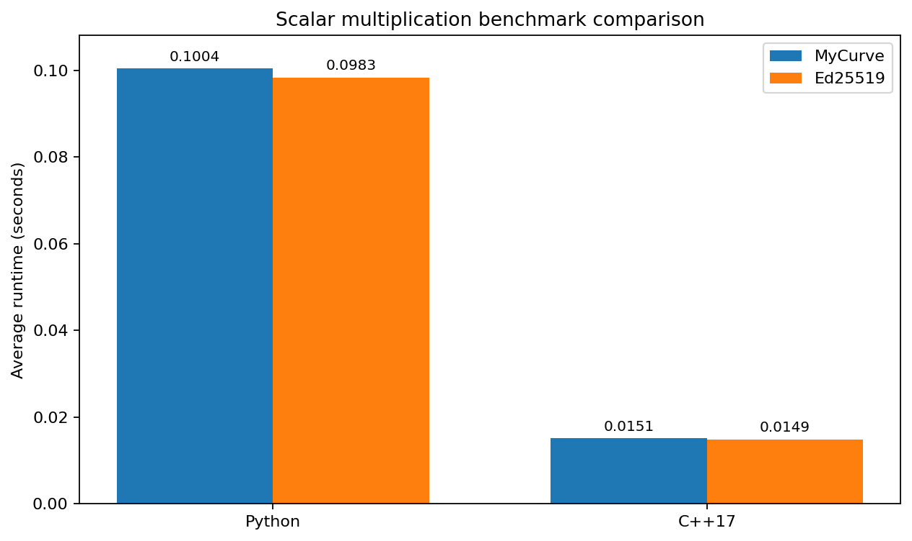

# Custom EdDSA-Style Twisted Edwards Research

Reproducible research artifacts for a custom 256-bit Twisted Edwards parameter
set, including algebraic validation, EdDSA-style educational signing code,
side-channel analysis, and matched Python/C++17 scalar-multiplication
benchmarks against Ed25519 parameters.

> [!IMPORTANT]
> This repository is an academic prototype. It is not an audited cryptographic
> library and must not be used to protect production keys or data.

## Scope

The project studies the curve

```text
-x^2 + y^2 = 1 + d*x^2*y^2 (mod p)
```

with a prime-order subgroup of order `q`, cofactor `h = 8`, and base point
`G`. The benchmark measures scalar multiplication `kG` only. It does not claim
to measure complete EdDSA signing or verification.

## Repository layout

```text
parameters/       Machine-readable custom and Ed25519 parameters
src/python/       Python reference implementation and benchmark
src/cpp/          Matched C++17 benchmark
tests/            Algebraic and signature correctness tests
results/          Reported measurements and generated figures
docs/             Methodology, security limits, and reproduction guide
notebooks/        Original exploratory notebook
paper/            Original report artifact
scripts/          Plot generation
```

## Quick start

Python validation and benchmark:

```bash
python src/python/eddsa_reference.py
python src/python/benchmark.py --trials 100 --output results/python-latest.csv
python -m unittest discover -s tests -v
```

C++17 benchmark (Boost.Multiprecision is header-only):

```bash
cmake -S . -B build -DCMAKE_BUILD_TYPE=Release
cmake --build build --config Release
./build/eddsa_benchmark 100
```

Generate the comparison figure:

```bash
python scripts/plot_results.py
```

## Current reported measurements

| Runtime | Curve | Trials | Average (s) | Minimum (s) | Maximum (s) |
|---|---|---:|---:|---:|---:|
| Python | MyCurve | not recorded | 0.1003544 | 0.0943864 | 0.1370574 |
| Python | Ed25519 | not recorded | 0.0982963 | 0.0924462 | 0.1092304 |
| C++17 | MyCurve | 100 | 0.0151267 | 0.0125334 | 0.0212813 |
| C++17 | Ed25519 | 100 | 0.0148832 | 0.0116208 | 0.0219940 |



These are observed min/max ranges, not theoretical performance bounds. The
raw provenance is documented in [docs/RESULTS.md](docs/RESULTS.md).

## Constant-time claim boundary

Both reference benchmarks use a fixed 256-iteration scalar loop and calculate
the candidate addition before mask-based selection. This removes the obvious
`while (k > 0)` and `if (k & 1)` scalar-dependent control flow.

That does **not** make the implementations fully constant-time. Python integers
and Boost `cpp_int` use variable-size storage and variable-time arithmetic.
Modular inversion and allocation behavior may also leak information. See
[docs/SIDE_CHANNELS.md](docs/SIDE_CHANNELS.md) for the exact claim boundary and
the fixed-limb production roadmap.

## Parameter assurance

The included parameters pass the basic checks performed during consolidation and by the test suite:

- `p` and `q` are probable primes.
- `G` lies on the stated curve.
- `qG` is the identity.
- the declared cofactor is `8`.
- sign/verify succeeds and rejects a modified message.

The original notebook does not contain a public seed and deterministic
generation transcript. The parameters therefore must not be described as
fully verifiably random or as having a complete nothing-up-my-sleeve proof.

## Documentation

- [Benchmark methodology](docs/BENCHMARK_METHODOLOGY.md)
- [Side-channel analysis](docs/SIDE_CHANNELS.md)
- [Parameter provenance](docs/PARAMETER_PROVENANCE.md)
- [Results interpretation](docs/RESULTS.md)
- [Reproduction guide](docs/REPRODUCIBILITY.md)

